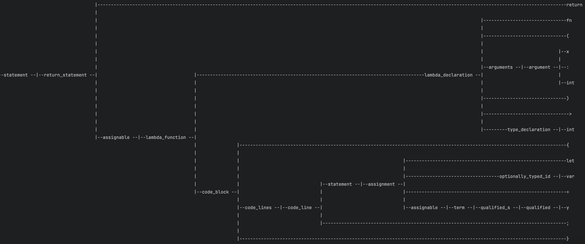
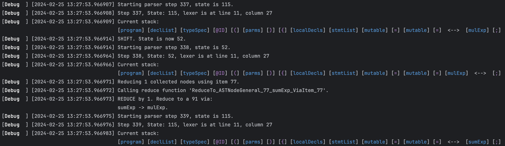
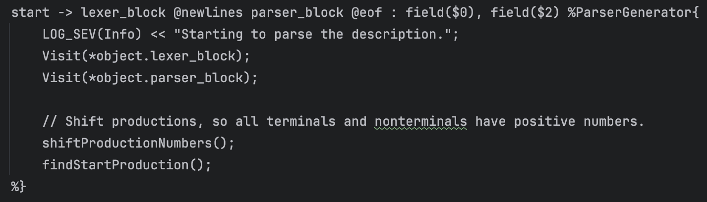

# Manta


Manta lexer and parser generators.


## Feature Overview

Manta is a work in progress (and somewhat of my personal playground), and is such is not feature complete. However, it
has a number of interesting capabilities that have been designed and implemented so far.

### Programatic Parser Generation

This was the original Parser Generator feature of Manta. It has been largely superseded by the parser code generation
approach (see below), but it is still an interesting feature in its own right. Given a definition of a parser and lexer,
Manta will create a table driven LALR parser (and accompanying lexer) that can parse the language defined by the
grammar. Unlike the parser code generation approach, this approach does not generate code that needs to be compiled, but
a parser that can be used immediately. Since it cannot encode the structure of the parser into the type system, it
represents AST nodes in a simple, flexible way, where each node has a name, a vector of children, and a string value.
The grammar can be annotated to specify how the AST nodes should be constructed, e.g., only add certain nodes in the
reduction to the new parse node, add all children of one of the children of the reduction instead of adding the child
itself, etc. This allows for generating much more concise ASTs.

An example application highlighting this feature
is [applications/ProgrammaticParserDriver.cpp](applications/ProgrammaticParserDriver.cpp). It reads grammar from a file,
creates the parser object, and then uses it to parse the contents of another file, returning the AST. It also prints out
some useful additional items, like the parse table, a log of the parse (of the code) itself, and an ascii representation
of the parse tree. If the code file is large, the tree can be quite large as well.



Because of its simplicity, I find that the programmatic parser generator is helpful in debugging grammars, since it gets
immediate results, and the application prints out useful information about the parse table and bottom up parse itself by
default.

### Parser Code Generation

Given a grammar, Manta can generate C++ parser code for a LALR (or LR(0) or SLR) parser. Given the grammar, Manta
figures out what classes
it needs to generate to represent the grammar, what the layout of those classes should be, constructs enums, generates a
lexer, sets up the parser and its reduction code, etc. Visitor classes can be
automatically generated too by annotating the grammar (more on that later).

As a nontrivial example of what Manta can handle, [I found a nice grammar](http://marvin.cs.uidaho.edu/Teaching/CS445/)
for a language called **C-**, which
is a small C/C++ like language. It is a fairly complex language, complex enough that it could be used as a real
language, but it is LALR parseable, and context free.
The [grammar](http://marvin.cs.uidaho.edu/Teaching/CS445/c-Grammar.pdf) for the language is
in [examples/C-/C- grammar.txt](examples/C-/C-%20grammar.txt), and example code (taken
from [here](http://marvin.cs.uidaho.edu/Teaching/CS445/c-Grammar.pdf)) is
in [examples/C-/C- code.cmm](examples/C-/C-%20code.cmm).

The example C-minus code looks like this:

```C
char zev[10]: "corgis";
char yurt[20];
int x:42, y:666;

int ant(int bat, cat[]; bool dog, elk; int fox; char gnu) {
    int goat, hog[100];
    gnu = 'W';
    goat = hog[2] = 3*cat; // hog is 3 times the size of array passed to cat
    if dog and elk or bat > cat[3] then dog = not dog;
    else fox++;
    if bat <= fox then {
        while dog do {
            static int hog; // hog in new scope
            hog = fox;
            dog = fred(fox++, cat)>666;
            if hog>bat then break;
            else if fox!=0 then fox += 7;
        }
    }
    for i = 0 to *zev-1 do outputc(zev[i]); outnl();
    if zev > "dog" then outputs("bark");
    yurt = zev;
    yurt[3] = zev[?*zev];
    return (fox+bat*cat[bat])/-fox;
}

// note that functions are defined using a statement
int max(int a, b) if a>b then return a; else return b;

// use the max operator
int max3(int a, b, c) return a:>: b:>: c;
```

The parser code generated from this grammar can be
found in [include/manta/generatedparsers/CminusParser.h](include/manta/generatedparsers/CminusParser.h). The generated
parser code is quite long, roughly 10,000 lines. Finding a more efficient way to represent the parse table is a work in
progress, since my current method is very easy to read and understand, but not very efficient.

I also set up
an example application to run the generated parser on the input code, and use a printing visitor to print out the AST (
not the most pretty visualization - I'm working on that). The application is
in [applications/CminusParserDriver.cpp](applications/CminusParserDriver.cpp). It is set up to write some nice logs that
let you see how the bottom up parser is working.



An application named [TestParserCodegen](applications/ParserCodegenDriver.cpp) is provided that is capable of reading
Manta parser definitions and generating the parser code.

### Parser description annotation and type deduction

If the grammar is not annotated, each non-terminal will be represented by its own class (more or less - some automatic
simplification or differentiation will
happen based on the exact grammar). However, it is often the case that we do not need the full, most exhaustive AST for
a grammar. You can imagine if your parse was something like **expression -> term -> factor -> number**, it might be
advantageous to short circuit this and just build a parse tree that looks like **expression -> number**. Note that the
type annotations that the parser code generator recognizes are similar but not identical to the type annotations that
the programmatic parser generator uses.

For an example of the Manta grammar that (almost) represents a parser for the Manta grammar, see
*config/full_rules_codegen.txt*

As a quick demonstration of the kind of things that are supported, consider the following

This defines a production for the non-terminal symbol "start" to be a "lexer_block", then a newlines lexeme (the @
referes to a lexeme from the lexer), then a "parser_bock", then the EOF lexeme. The two "field" instructions after the
color are annotations, they mean that the AST node that is generated for the production should store the lexer_block
ASTNode in a field (the $0 means the first child of the production), and the parser_block ASTNode in a field. The
%ParserGenerator section is a method of injecting code (what follows between the "{" and the "%}") into a visitor object
called "ParserGenerator" that will also be generated.

A fun thing I tried in this version was type deduction for all the AST nodes' fields. All lexemes (right now) are string
types. The three families of instructions that can be used on a node are **field**, which creates a field in the AST
node, **push**, which takes a node or data from a field in a node and pushes it into a vector member of this node, and *
*append** which appends the vector field from another node onto the vector field of this node.

I have not yet fully documented the grammar for the grammar, including all the annotation options, this is a work in
progress.

A major work in progress is better ability to define functions for the parser to call during parsing, including during a
reduction, and a more powerful and flexible type system incorporated into the type deduction system. For example, right
now, all lexemes are strings. But it would be useful to define a function that knows how to convert a string to an
integer, or double, or any other type, and call that during a reduction. I have take a number of steps in this
direction, but do not have anything ready for use yet. One of my goals is for the system to be flexible enough that the
entire Manta parser generator frontend itself can be represented in the Manta grammar via generating a Manta grammar
parser and one or more visitor classes that can traverse the Manta AST and call existing classes to fully set up the
parser code generation.
